# Модель линейной регрессии

Резюме: Этот проект фокусируется на обучении с учителем, в частности на линейных моделях, методах регуляризации, переобучении, недообучении и метриках для оценки качества.

💡 [Нажмите здесь](https://new.oprosso.net/p/4cb31ec3f47a4596bc758ea1861fb624) **чтобы оставить отзыв о проекте**. Это анонимно и поможет нашей команде улучшить ваш образовательный опыт. Мы рекомендуем пройти опрос сразу после завершения проекта.

## Содержание

1. [Глава I. Предисловие](#глава-i-предисловие)
2. [Глава II. Введение](#глава-ii-введение) \
    2.1. [Проблема регрессии](#проблема-регрессии) \
    2.2. [Линейная регрессия](#линейная-регрессия) \
    2.3. [Градиентный спуск](#градиентный-спуск) \
    2.4. [Переобучение и недообучение](#переобучение-и-недообучение) \
    2.5. [Метрики качества](#метрики-качества) \
    2.6. [Альтернативная формулировка задачи линейной регрессии](#альтернативная-формулировка-задачи-линейной-регрессии)
3. [Глава III. Цель](#глава-iii-цель) 
4. [Глава IV. Инструкции](#глава-iv-инструкции)
5. [Глава V. Задача](#глава-v-задача)

## Глава I. Предисловие

В последнем проекте мы обсудили, что такое машинное обучение и какие проблемы решает эта область науки. А также подробную серию примеров самых сложных задач и по каким группам их можно разделить. Цель открытого проекта — одна из этой группы и познакомится с первым ребенком — линейной моделью.

Но прежде чем мы начнем, я хотел бы кратко описать, как обычно подходят к описанию всех инструментов. Затем мы рассмотрим формулировку задачи с математической точки зрения. А основным инструментом для решения этих формулировок будет следующий алгоритм:

Мы ограничиваем пул возможных решений определенным множеством (набором функций).

Например, мы хотим предсказать температуру y по давлению x, имея только 1 наблюдение. Мы ограничиваемся множеством линейных функций:

$$y \approx \hat{y}=f(x)=wx.$$

Обычно каждое решение в этом множестве может быть однозначно определено параметрами. В нашем примере это параметр *a*.

Мы выбираем функцию потерь, которая четко демонстрирует наше желание найти решение, которое удовлетворяет цели задачи.

В нашем примере это стандартное отклонение, которое принимает высокие значения, когда наше предсказание далеко от истинного значения:

$$L \left( y, \hat{y} \right) = \left( y - \hat{y} \right)^2.$$

Таким образом, поиск нашего оптимального решения сводится к поиску решения, для которого функция потерь минимальна. Однако, поскольку функция будет зависеть от параметра, мы можем сказать, что цель — найти такие параметры, для которых функция потерь минимальна.

В нашем примере формальная задача будет выглядеть так:

$$\arg \min_{\hat{y}} L \left( y, \hat{y} \right) = \arg \min_{w} L(y, wx).$$

То, что функция потерь зависит от параметров, позволяет нам использовать производные и методы оптимизации (включая градиентный спуск) для поиска оптимальных значений параметров.

В нашем примере:

$$\frac{\partial L}{\partial w}=-2w(y-wx)=0 \Rightarrow w=\lbrace \frac{y}{x}, 0 \rbrace.$$

Часто будет возможно посмотреть на ту же задачу математически с другой стороны, решая её в альтернативной формулировке. Это откроет новые смыслы в решении, которые помогут вам лучше понять детали. Поэтому мы настоятельно рекомендуем не останавливаться на материалах, упомянутых в этом курсе, и периодически улучшать свое понимание того или иного подхода.

В этой главе мы обсудим задачи регрессии, которые ограничивают пул возможных решений линейными моделями. Наряду с самой моделью мы рассматриваем вещи, тесно связанные с процессом разработки модели: определения переобучения/недообучения, как с ними бороться и как оценивать качество моделей.

## Глава II. Введение

### Проблема регрессии

Предположим, у нас есть набор входных данных *X*, которые соответствуют выходным данным *y*. Цель — найти функцию отображения f из *X* в *y*. В задачах регрессии $`y ∈ R`$ и наш $`X ∈ R^n`$. Другими словами:

$$f: X \rightarrow y, \text{ где } y \in \mathbb{R} \text{ — цель, } X \text{ — обучающие данные }.$$

Существует множество примеров реальных задач регрессии. Рассмотрим самые популярные:
* Предсказание возраста зрителя, смотрящего телевизор или видео каналы.
* Предсказание амплитуды, частоты и других характеристик сердцебиения.
* Предсказание количества необходимых такси из-за определенных погодных условий.
* Предсказание температуры в любом месте внутри здания с использованием данных о погоде, времени, датчиков дверей и т.д.

В случае линейной регрессии ключевое свойство заключается в том, что ожидаемое значение выхода предполагается линейной функцией входа:

$$f(\mathbf{x}) = \mathbf{w}^T \mathbf{x} + b.$$

Это делает модель легкой для подгонки к данным и легкой для интерпретации.

Для регрессии наиболее распространенным выбором является использование квадратичных потерь, или $l2$ потерь, или MSE — средней квадратичной ошибки:

$$l_2 \left(y, \hat{y} \right) = \left( y - \hat{y} \right)^2.$$

где $\hat y$ — оценка модели. Мы используем потери для минимизации ошибки и для подгонки модели. Давайте углубимся в модель линейной регрессии.

### Линейная регрессия

Одним из наиболее широко используемых, но не всегда эффективных алгоритмов для решения задач регрессии является модель линейной регрессии. Основная цель этой модели — оценить линейную функцию обучающего набора с наименьшей ошибкой.

Мы можем подогнать эти данные с помощью простой модели линейной регрессии вида:

$$f(x;\boldsymbol{\theta}) = b + \mathbf{w} x,$$

где $\mathbf{w}$ — наклон, $b$ — смещение (или bias), и $\boldsymbol{\theta} = (\mathbf{w}, b)$ — все параметры модели. Регулируя $\boldsymbol{\theta}$, мы можем минимизировать сумму квадратов ошибок, пока не найдем решение наименьших квадратов:

$$\hat{\boldsymbol{\theta}} = \arg \min_{\boldsymbol{\theta}} \text{MSE}(\boldsymbol{\theta}),$$

$$\text{MSE}(\boldsymbol{\theta}) = \frac{1}{N}\sum_{n=1}^{N} \left( y_n - f(x_n; \boldsymbol{\theta})\right)^2$$

где MSE — средняя квадратичная ошибка.

Давайте углубимся в формальный способ, модель линейной регрессии можно записать как:

$$f(x;\boldsymbol{\theta}) = \mathbf{w}^T \mathbf{x} + b + \epsilon = \sum_{i=1}^D w_i x_i + b + \epsilon$$

где $ \mathbf{w}^T \mathbf{x}$ — внутреннее или скалярное произведение между входным вектором $\mathbf{x}$ и вектором весов модели $\mathbf{w}$, $b$ — смещение (или bias), а $\epsilon$ — остаточная ошибка между нашими линейными предсказаниями и истинным откликом.

Математически мы можем определить нашу задачу как минимизацию MSE. Для решения этих проблем мы можем использовать методы оптимизации, такие как градиентный спуск или метод Ньютона, или даже записать аналитическое решение, которое включает инверсию матрицы (после того, как вы выполните первую задачу, которую мы обсудим позже в этой главе — вы обнаружите, что инверсия матрицы является тяжелой вычислительной операцией). Ваша первая задача будет найти аналитическое решение задачи регрессии.

### Градиентный спуск

Общеизвестный факт, что градиент — это направление самого быстрого увеличения значения функции, а в противоположном случае антиградиент — это направление самого быстрого уменьшения. Таким образом, градиентный спуск заключается в поиске локального минимума дифференцируемой функции. И поскольку наша основная цель в почти любой задаче машинного обучения — уменьшить значение функции потерь, градиентный спуск идеально подходит для этой потребности.

Для этого мы должны итеративно повторять следующие шаги:

1. Вычислить значение градиента

    $$\frac{\partial L}{\partial \boldsymbol{\theta}} = \nabla L = \left( \begin{array}{c} \frac{\partial L}{\partial \theta_1} \\ \dots \\ \frac{\partial L}{\partial \theta_n} \end{array} \right).$$

2. Обновить значения параметров, используя формулу:

    $$\boldsymbol{\theta}^{i+1} = \boldsymbol{\theta}^i - \gamma \nabla L \left( \boldsymbol{\theta}^i \right),$$
    
    где $\gamma$ — скорость обучения, которая определяет, как далеко мы должны идти, а 0 обычно определяется случайно.

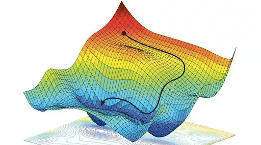

Существует множество модификаций градиентного спуска для более точных результатов и быстрых вычислений. 
Мы рассматриваем основную модификацию — стохастический градиентный спуск. Сила этого метода заключается в том, что мы стохастически выбираем объект (или набор объектов) и вычисляем градиент только на этом объекте. Это помогает сэкономить много времени, но качественная эффективность не имеет огромных падений.

Мы рекомендуем вам прочитать о других модификациях GD, таких как Adagrad, RMSProp, Adam и методы Momentum, а также вы можете прочитать о методах второго порядка, таких как метод Ньютона.

### Переобучение и недообучение

Фундаментальная проблема MLE заключается в том, что он пытается выбрать параметры, которые минимизируют потери на обучающем наборе, но это может не привести к модели, которая имеет низкие потери на будущих данных. Это называется переобучением.

Поэтому при подгонке высоко гибких моделей мы должны быть осторожны, чтобы не переобучать данные, т.е. мы должны избегать попыток моделировать каждое небольшое изменение на входе, поскольку это скорее всего шум, чем истинный сигнал.

Это иллюстрируется на рисунке ниже, где мы видим, что использование полинома высокой степени приводит к кривой, которая очень "извилистая". Истинная функция вряд ли имеет такие экстремальные колебания. Поэтому использование такой модели может привести к точным предсказаниям будущих выходов.

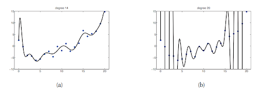

Недообученная модель противоположна переобученной модели — модель, которая не изучает никаких зависимостей из обучающего набора данных или изучает их неправильным образом. Это снова приводит к плохой производительности на тестовом наборе данных. Например, нам нужно классифицировать рукописные цифры, и оказывается, что все изображения 8 имеют 67 темных пикселей, в то время как все остальные примеры не имеют.

Модель может решить использовать эту случайную закономерность и, таким образом, правильно классифицировать все обучающие примеры 8, не изучая истинные закономерности. И когда мы передаем некоторые новые изображения 8, написанные в другом масштабе, мы получаем очень плохую производительность, потому что количество темных пикселей будет другим. Модель не изучает необходимые паттерны.

Другими словами, нам нужно настроить модель, чтобы сбалансировать между этими 2 случаями. Это также известно как компромисс смещения-дисперсии. Ошибка, которую мы производим при подгонке и оценке модели, может быть разделена на 2 части (на самом деле 3, но мы не можем повлиять на третью): смещение и дисперсию. Чтобы понять, что означает каждый тип ошибки, см. рисунок из [Wikipedia](https://en.wikipedia.org/wiki/Bias%E2%80%93variance_tradeoff):

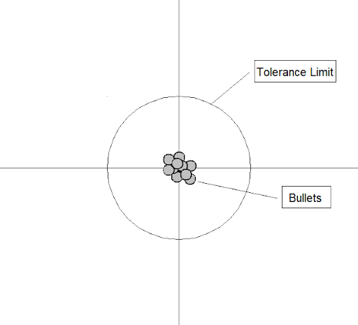
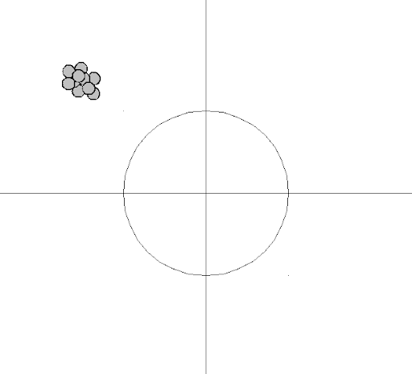

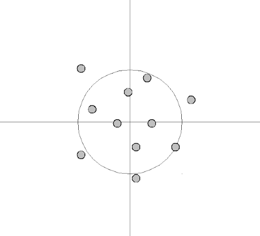
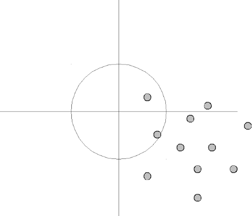

> By Bernhard Thiery — Own work, CC BY-SA 3.0

* "Ошибка смещения — это ошибка из-за неправильных предположений в алгоритме обучения. Высокое смещение может привести к тому, что алгоритм пропустит релевантные связи между признаками и целевыми выходами (недообучение)."
* "Дисперсия — это ошибка от чувствительности к небольшим колебаниям в обучающем наборе. Высокая дисперсия может привести к тому, что алгоритм будет моделировать случайный шум в обучающих данных (переобучение)."

Надеюсь, большинство моделей в машинном обучении имеют дело с ошибкой смещения и могут иметь проблемы в основном с дисперсией. Но существует множество специальных техник для уменьшения переобучения модели. Здесь мы хотим представить одну из них, которая называется регуляризацией.

### Регуляризация

Обычно регуляризация происходит из того факта, что она просто потребляет аддитив в функции потерь, который зависит от параметров модели.

$$\min_{\boldsymbol{\theta}} \sum_{i=1}^N L \left( f(x_i, \boldsymbol{\theta}), y_i \right) + \lambda R(\boldsymbol{\theta})$$

Идея этого дополнения заключается в том, что модели не пытаются изучить сложные паттерны и пытаются найти решение. Другими словами, если модель начинает переобучаться в процессе поиска решения, то дополнение в функции ошибки начнет увеличиваться, заставляя модель прекратить обучение.

Для линейной регрессии обычно используются 2 варианта этих дополнений:
* L2 — тогда линейная модель называется моделью Ridge

    $$R(\boldsymbol{\theta}) = \| \boldsymbol{\theta}\|_2^2 = \sum_{i=1}^d \theta_i^2$$

* L1 — тогда линейная модель называется моделью Lasso

    $$R(\boldsymbol{\theta}) = \| \boldsymbol{\theta}\|_1 = \sum_{i=1}^d |\theta_i|$$

* Sklearn также имеет отдельный класс, когда эти 2 регуляризации объединены, и такая модель называется Elastic

Подумайте, как алгоритм изменится для поиска решения для линейной модели, если вы добавите L1 и L2 регуляризацию к функции потерь. Предоставьте ответ внутри вашего проекта.

### Метрики качества

Давайте углубимся в метрики качества для оценки задач регрессии. Мы уже изучили среднюю квадратичную ошибку. И после изучения определения ℓ1 регуляризации вы уже знаете, что такое средняя абсолютная ошибка. Но эта метрика не относительная. Что это означает?

Допустим, мы решаем задачу дохода клиентов, поэтому наша целевая переменная непрерывная. И MAE нашей модели составляет 5000. Как мы можем оценить, достаточно ли хороша наша модель?

Сделайте перерыв и подумайте несколько минут. Здесь мы обсудим несколько способов решения этой проблемы. Первый и самый простой — сравнить нашу модель с наивными прогнозами. Например, мы могли бы найти среднее значение нашей целевой переменной и установить его как предсказание для тестовой выборки для всего набора клиентов. Наконец, сравните MAE нашей модели и наивного предсказания. Здесь мы рекомендуем найти лучшее наивное предсказание для MSE и MAE. Также подумайте, как мы могли бы улучшить наивное предсказание для лучшего качества.

Второй способ, который мы обсудим здесь, — преобразовать относительные метрики в абсолютные. Средняя абсолютная процентная ошибка (MAPE) — одна из широко используемых метрик регрессивных проблем. MAPE — это сумма индивидуальных абсолютных ошибок, деленная на спрос (каждый период отдельно). Это среднее процентных ошибок. По сравнению с MAE, MAPE имеет точный диапазон. Для лучшего понимания рассмотрите некоторые примеры и измерьте различные метрики, а также мы рекомендуем определить MSLE и коэффициент R squared.

### Альтернативная формулировка задачи линейной регрессии

Давайте посмотрим на линейную регрессию с вероятностной точки зрения, и мы можем переписать модель с связью между линейной регрессией и гауссовыми распределениями в следующей форме:

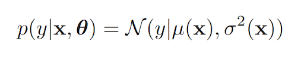

где $N(µ, \sigma^2)$ — **гауссово** или **нормальное** распределение с µ как **средним** и $\sigma^2$ как **дисперсией**.

Это делает ясным, что модель — это **функция плотности условной вероятности**. В простейшем случае мы предполагаем, что $\mu$ — это линейная функция от $x$, поэтому $µ= w^Tx$, и что шум фиксирован, $\sigma^2(x) = \sigma^2$.

В этом случае $\theta = (w,\sigma^2)$ — **параметры** модели.

Например, предположим, что вход одномерный. Мы можем записать ожидаемый отклик как:

$$µ(x)= w_0+ w_1x = w^Tx,$$

где $w_0$ — член перехвата или смещения, $w_1$ — наклон, и мы определили вектор $x = (1, x)$.

Давайте попробуем разобраться, как определить параметры модели линейной регрессии.

Общий способ оценки параметров статистической модели — вычислить MLE — оценку максимального правдоподобия.
MLE — это метод оценки неизвестного параметра путем максимизации функции правдоподобия, которую мы можем определить как:

$$\hat \theta = arg \max\limits_{\theta} L(\theta) = arg \max\limits_{\theta} \prod_{i=1}^l P(y_i|x_i, \theta)$$

где $L(\theta)$ — функция правдоподобия.

Обычно предполагается, что обучающие примеры независимы и одинаково распределены. Это означает, что мы можем записать логарифмическое правдоподобие следующим образом:

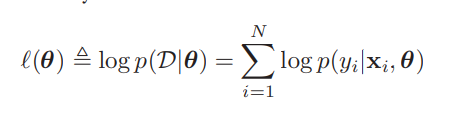

Вместо максимизации логарифмического правдоподобия мы можем эквивалентно минимизировать отрицательное логарифмическое правдоподобие или NLL:

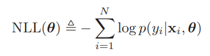

Формулировка NLL иногда более удобна, потому что многие программные пакеты оптимизации предназначены для поиска минимумов функций, а не максимумов. Теперь давайте применим метод MLE к настройке линейной регрессии. Подставляя определение гауссова распределения в вышеприведенное, мы находим, что логарифмическое правдоподобие задается:

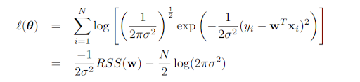

RSS означает сумму квадратов остатков и задается:

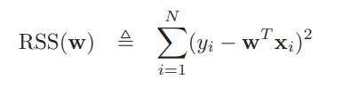

RSS также называется суммой квадратов ошибок, или SSE, а SSE/N называется средней квадратичной ошибкой, или MSE. Это также может быть записано как квадрат ℓ2 нормы вектора остаточных ошибок:

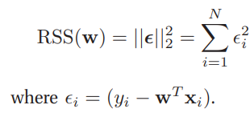

Линейная регрессия может быть сделана для моделирования нелинейных отношений, заменяя x на нелинейную функцию входов φ(x). То есть мы используем

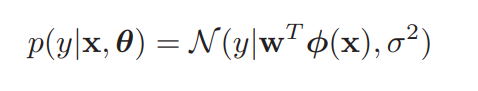

где могут быть степени признаков:

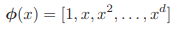

Оценка максимального правдоподобия может привести к переобучению. В некоторых случаях наша задача — минимизация RSS — может иметь бесконечные решения. Можете ли вы дать нам некоторые примеры таких случаев? Сделайте перерыв и подумайте. Ответ: ну, несколько распространенных случаев для этой проблемы — высоко коррелированные признаки и случаи, когда размерность признаков больше размерности объекта. Тогда есть проблемы с огромным значением весов и переобучением. Чтобы решить эту проблему, мы можем добавить параметры регуляризации в наше уравнение минимизации. Есть два основных параметра регуляризации, ℓ2 и ℓ1:

$$l2 = ||w||_2 = \sum_{l=1}^d w_i^2,$$
$$l1 = ||w||_1 = \sum_{l=1}^d |w_i|.$$

С вероятностной точки зрения мы можем определить регуляризацию оценкой MAP (Maximum A Posterior estimate) с нулевым средним гауссовым априорным распределением на весах:

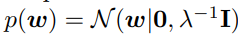

Это называется регрессией Ridge. Более конкретно, мы вычисляем оценку MAP следующим образом:

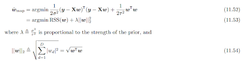

> Источник: [Kevin Murphy, Probabilistic Machine Learning: An Introduction](https://probml.github.io/pml-book/book1.html)

— это ℓ2 норма вектора w. Таким образом, мы штрафуем веса, которые становятся слишком большими. В общем, эта техника называется ℓ2 регуляризацией или затуханием весов и широко используется.

## Глава III. Цель

Цель этой задачи — получить глубокое понимание линейных моделей для регрессии.

## Глава IV. Инструкции

* Этот проект будет оцениваться только людьми. Вы свободны организовывать и называть свои файлы как пожелаете.
* Мы используем Python 3 как единственную правильную версию Python.
* Для обучения алгоритмов глубокого обучения вы можете попробовать [Google Colab](https://colab.research.google.com). Он предоставляет ядра (runtime) с GPU бесплатно, что быстрее CPU для таких задач.
* Стандарт не применяется к этому проекту. Однако вас просят быть ясными и структурированными в дизайне вашего исходного кода.
* Храните наборы данных в подпапке data.

## Глава V. Задача

Мы продолжим нашу практику с проблемой с Kaggle.com. В этой главе мы реализуем все модели, описанные выше. Измерим метрики качества на обучающих и тестовых частях. Обнаружим и регуляризуем переобученные модели. И углубимся в оценку наивной модели и сравнение.

1. Ответьте на вопросы
   1. Выведите аналитическое решение задачи регрессии. Используйте векторную форму уравнения.
   2. Что изменяется в решении, когда L1 и L2 регуляризации добавляются к функции потерь.
   3. Объясните, почему L1 регуляризация часто используется для выбора признаков. Почему многие веса равны 0 после подгонки модели?
   4. Объясните, как вы можете использовать те же модели (Линейная регрессия, Ridge и т.д.), но сделать возможным подгонку нелинейных зависимостей.

2. Введение — выполните весь препроцессинг из предыдущего урока
   1. Импортируйте библиотеки.
   2. Прочитайте обучающие и тестовые части.
   3. Предобработайте признак "Interest Level".

3. Вводная часть анализа данных 2
   1. Давайте сгенерируем дополнительные признаки для лучшего качества модели. Рассмотрим столбец под названием "Features". Он состоит из списка особенностей текущей квартиры.
   2. Удалите неиспользуемые символы ([,], ', ", и пробел) из столбца.
   3. Получите все значения в каждом списке и соберите результат в один огромный список для всего набора данных. Вы можете использовать DataFrame.iterrows().
   4. Сколько уникальных значений содержит результирующий список?
   5. Давайте познакомимся с новой библиотекой — Collections. С этим пакетом вы сможете эффективно получить статистику количества о ваших данных.
   6. Подсчитайте самые популярные функции из нашего огромного списка и возьмите топ-20 на данный момент.
   7. Если все правильно, вы должны получить следующие значения: 'Elevator', 'CatsAllowed', 'HardwoodFloors', 'DogsAllowed', 'Doorman', 'Dishwasher', 'NoFee', 'LaundryinBuilding', 'FitnessCenter', 'Pre-War', 'LaundryinUnit', 'RoofDeck', 'OutdoorSpace', 'DiningRoom', 'HighSpeedInternet', 'Balcony', 'SwimmingPool', 'LaundryInBuilding', 'NewConstruction', 'Terrace'.
   8. Теперь создайте 20 новых признаков на основе топ-20 значений: 1, если значение находится в столбце "Feature", иначе 0.
   9. Расширьте наш набор признаков с 'bathrooms', 'bedrooms' и создайте специальную переменную feature_list со всеми именами признаков. Теперь у нас есть 22 значения. Все модели должны обучаться на этих 22 признаках.

4. Реализация моделей — Линейная регрессия
   1. Инициализируйте генератор случайных чисел с семенем 21.
   2. Реализуйте Python класс для алгоритма линейной регрессии с двумя основными методами — fit и predict. Используйте стохастический градиентный спуск (SGD) для поиска оптимальных весов модели. Для лучшего понимания мы рекомендуем реализовать отдельные версии алгоритма с аналитическим решением и нестохастическим градиентным спуском под капотом.
   3. Что такое детерминированная модель? Сделайте SGD детерминированным.
   4. Определите коэффициент R squared (R2) и реализуйте функцию для его вычисления.
   5. Сделайте предсказания с вашим алгоритмом и оцените модель с метриками MAE, RMSE и R2.
   6. Инициализируйте LinearRegression() из sklearn.linear_model, подгоните модель и предскажите обучающие и тестовые части, как в предыдущем уроке.
   7. Сравните метрики качества и убедитесь, что разница небольшая (между вашими реализациями и sklearn).
   8. Сохраните метрики, как в предыдущем уроке, в таблице со столбцами model, train, test для таблицы MAE, таблицы RMSE и коэффициента R2.

5. Реализация регуляризованных моделей — Ridge, Lasso, ElasticNet
   1. Реализуйте алгоритмы Ridge, Lasso, ElasticNet: расширьте функцию потерь с L2, L1 и обеими регуляризациями соответственно.
   2. Сделайте предсказания с вашим алгоритмом и оцените модель с метриками MAE, RMSE и R2.
   3. Инициализируйте Ridge(), Lasso() и ElasticNet() из sklearn.linear_model, подгоните модель и сделайте предсказания для обучающих и тестовых выборок, как в предыдущем уроке.
   4. Сравните метрики качества и убедитесь, что разница небольшая (между вашими реализациями и sklearn).
   5. Сохраните метрики, как в предыдущем уроке, в таблице со столбцами model, train, test для таблицы MAE, таблицы RMSE и коэффициента R2.

6. Нормализация признаков
   1. Сначала напишите несколько примеров, почему и где нормализация признаков обязательна и наоборот.
   2. Давайте рассмотрим первый из классических методов нормализации — MinMaxScaler. Напишите математическую формулу для этого метода.
   3. Реализуйте свою собственную функцию или класс для нормализации признаков MinMaxScaler.
   4. Инициализируйте MinMaxScaler() из sklearn.preprocessing.
   5. Сравните нормализацию признаков с вашим собственным методом и с sklearn.
   6. Повторите шаги от b до e для другого метода нормализации StandardScaler.

7. Подгоните пользовательские и sklearn модели с нормализованными данными
   1. Подгоните все модели — Linear Regression, Ridge, Lasso и ElasticNet — с MinMaxScaler.
   2. Подгоните все модели — Linear Regression, Ridge, Lasso и ElasticNet — с StandardScaler.
   3. Добавьте все результаты в наш dataframe с метриками на выборках.

8. Переобученные модели
   1. Давайте посмотрим на переобученную модель на практике. Из теории вы знаете, что полиномиальная регрессия легко переобучается. Итак, давайте создадим игрушечный пример и посмотрим, как регуляризация работает в реальной жизни.
   2. В предыдущем уроке мы создали полиномиальные признаки со степенью 10. Здесь мы повторяем эти шаги из предыдущего урока, помня, что у нас есть только 3 основных признака — 'bathrooms', 'bedrooms', 'interest_level'.
   3. И обучите и подгоните все наши реализованные алгоритмы — Linear Regression, Ridge, Lasso и ElasticNet — на наборе полиномиальных признаков.
   4. Сохраните результаты метрик качества в результирующем dataframe.
   5. Проанализируйте результаты и выберите лучшую модель по вашему мнению.
   6. Дополнительно попробуйте разные альфа параметры регуляризации в алгоритмах, выберите лучший и проанализируйте результаты.

9. Наивные модели
   1. Вычислите среднее и медианные метрики из предыдущего урока и добавьте результаты в финальный dataframe.

10. Сравните результаты
    1. Распечатайте ваши финальные таблицы
    2. Какая лучшая модель?
    3. Какая самая стабильная модель?

11. Дополнительная задача
    1. Есть некоторые трюки с целевой переменной для лучшего качества модели. Если у нас есть распределение с тяжелым хвостом, вы можете использовать монотонную функцию для "улучшения" распределения. На практике вы можете использовать логарифмические функции. Мы рекомендуем выполнить это упражнение и сравнить результаты. Но не забудьте сделать обратное преобразование, если вы хотите сравнить метрики.
    2. Следующий трюк — выбросы. Угол линии линейной регрессии сильно зависит от выбросов. И часто вы должны удалить эти точки из !внимание! только обучающих данных. Вы должны объяснить, почему они были удалены только из обучающей выборки. Мы рекомендуем выполнить это упражнение и сравнить результаты.
    3. Также полезным упражнением будет реализация алгоритма линейной регрессии с batch и mini-batch обучением или аналитическим решением (как упоминалось в 4.1).

### Отправка

Сохраните ваш код в Python JupyterNotebook. Ваш коллега загрузит его и сравнит с базовым решением. Ваш код должен включать ответы на все обязательные вопросы. Дополнительная задача зависит от вас.

>Пожалуйста, оставьте отзыв о проекте в [форме обратной связи.](https://forms.yandex.ru/cloud/646b4693e010db2a75f1f5e6/)

